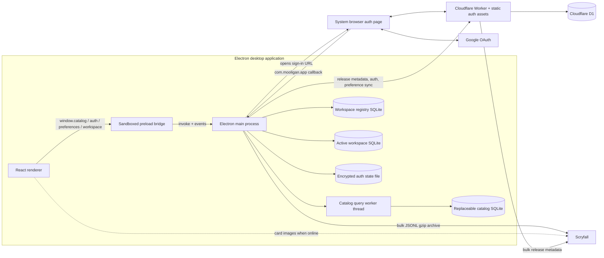
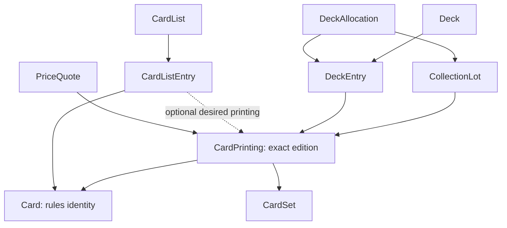
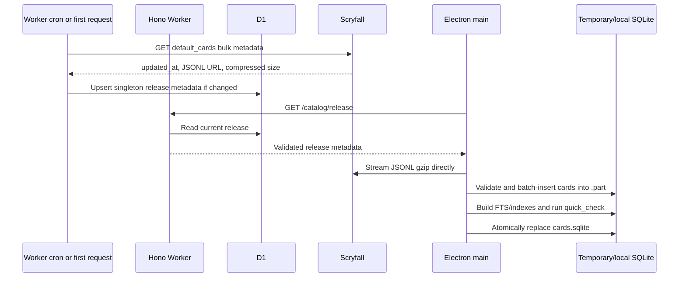

# Mooligan Architecture

> Current-state architecture, verified against the repository on 2026-08-11.
> Product intent comes from [`PROJECT.md`](PROJECT.md); implementation details
> come from the source code. Mooligan is still an early foundation, so this
> document distinguishes durable architectural rules from capabilities that are
> only partially implemented.

## 1. Executive summary

Mooligan is a local-first Magic: The Gathering desktop application. Its core
architecture is organized around one rule: the desktop must remain useful
without an account, a backend connection, or continuous internet access.

The system has three deployable or reusable parts:

1. **An Electron desktop application** containing a React renderer, a narrow
   preload bridge, an Electron main process, a catalog query worker, and local
   SQLite databases.
2. **A Cloudflare Worker API** containing catalog-release discovery, Better Auth
   identity endpoints, and the currently small synchronization API, backed by
   Cloudflare D1.
3. **A shared domain package** containing Zod schemas and TypeScript types for
   cards, collections, decks, lists, market data, and catalog transport data.

The API also deploys a small browser-based authentication page. It is built as
part of the API rather than maintained as an independent application.

The most important ownership boundary is:

- User-owned data lives and is edited locally first.
- The Scryfall card catalog is local but replaceable reference data.
- Cloud data adds identity and optional synchronization; it is not the desktop
  application's working copy.
- Authentication secrets, SQLite access, filesystem access, and network sync
  stay outside the renderer process.

## 2. System context



This topology avoids turning Electron into a thin client. Once a valid catalog
has been installed, text search and user-owned workspace access do not require
the Worker. Card artwork is not cached by the current implementation, so image
thumbnails can still be unavailable while offline.

## 3. Repository structure

The repository is a pnpm workspace managed through Vite+.

| Location                                 | Responsibility                                                                                               |
| ---------------------------------------- | ------------------------------------------------------------------------------------------------------------ |
| [`apps/desktop`](apps/desktop)           | Electron packaging, privileged main-process services, preload IPC contract, and React UI                     |
| [`apps/api`](apps/api)                   | Hono Cloudflare Worker, Better Auth, catalog-release metadata, preference sync, D1 migrations, and API tests |
| [`apps/api/auth-web`](apps/api/auth-web) | Minimal system-browser sign-in and callback UI, built into `apps/api/auth-dist`                              |
| [`packages/domain`](packages/domain)     | Runtime Zod schemas and TypeScript domain types shared by desktop and API                                    |
| [`plans`](plans)                         | Design records and staged implementation plans; these are context, not necessarily current behavior          |
| [`PROJECT.md`](PROJECT.md)               | Product direction and architectural decision criteria                                                        |
| [`vite.config.ts`](vite.config.ts)       | Repository-wide formatting, linting, and type-aware Vite+ configuration                                      |

There are three package workspaces (`desktop`, `api`, and `@mooligan/domain`)
plus the root toolchain project. `auth-web` has no package manifest of its own;
the API package builds and deploys it.

## 4. Architectural invariants versus current implementation

### Durable invariants

These are product-level constraints and should survive implementation changes:

- Core card, collection, deck, and list workflows are local and offline first.
- An account is optional.
- Local SQLite remains the working copy after sign-in.
- Cloud failure can pause sync but cannot block local reads or writes.
- User-owned workspace data and replaceable catalog data remain separate.
- The Electron main process owns privileged resources.
- Renderer access to privileged behavior goes through narrow, validated IPC.
- Account switching must not mix different users' local workspaces.
- Sync behavior is designed per domain instead of imposed through one generic
  synchronization abstraction.

### Current implementation choices

These describe today's foundation and can evolve without violating the rules
above:

- Node's built-in synchronous SQLite API (`node:sqlite`) is used locally.
- Collection lots, decks, and lists are stored as validated JSON payloads in
  simple entity tables.
- Only the `motion` preference is exposed and synchronized.
- Google is the only configured identity provider.
- D1 is the cloud database.
- Search stores selected denormalized card columns alongside the complete raw
  Scryfall JSON object.
- Collection, deck, list, set, sharing, and market UI flows are not complete.

## 5. Desktop application

### 5.1 Process model

The desktop application has four execution contexts:

| Context               | Entry point                                                                         | Owns                                                                                                                                             |
| --------------------- | ----------------------------------------------------------------------------------- | ------------------------------------------------------------------------------------------------------------------------------------------------ |
| Electron main process | [`electron/main.ts`](apps/desktop/electron/main.ts)                                 | Windows, IPC handlers, local databases, filesystem dialogs, catalog download/import, authentication, sync coordination, and OS protocol handling |
| Preload               | [`electron/preload.ts`](apps/desktop/electron/preload.ts)                           | A small typed API exposed on `window`; it contains no domain or persistence logic                                                                |
| React renderer        | [`src/main.tsx`](apps/desktop/src/main.tsx)                                         | Routes, UI state, query caches, and user interaction                                                                                             |
| Catalog worker thread | [`electron/catalog-query-worker.ts`](apps/desktop/electron/catalog-query-worker.ts) | Read-only catalog queries on a dedicated SQLite connection                                                                                       |

The renderer cannot import Node or Electron capabilities directly. The browser
window is created with sandboxing and context isolation enabled and Node
integration disabled.

### 5.2 Startup and lifecycle

Privileged startup is deliberately ordered in
[`electron/main.ts`](apps/desktop/electron/main.ts):

1. Enable the Electron sandbox.
2. Register the custom authentication scheme as privileged.
3. Capture protocol callbacks and acquire the single-instance lock before
   Electron is ready.
4. Register catalog IPC handlers.
5. After `app.whenReady()`, open the workspace registry and active workspace.
6. Resolve the embedded authentication origin and create the protected desktop
   auth client.
7. Create the preference sync coordinator and register the remaining IPC
   handlers.
8. Initialize any persisted session without blocking local workspace startup.
9. Create the renderer window, then publish current auth and sync snapshots.

Deep links can arrive through command-line arguments, macOS `open-url` events,
or a second application instance. [`auth-startup.ts`](apps/desktop/electron/auth-startup.ts)
deduplicates them by hash, queues early deliveries, and processes them serially
once the authentication client is ready.

### 5.3 Renderer composition

The renderer uses:

- React 19 for composition.
- TanStack Router with generated file-based routes.
- Hash history so navigation works from packaged `file:` URLs.
- TanStack Query as an in-memory cache for bridge-backed state and mutations.
- StyleX for component styling.
- Motion for route and interaction animation.
- Base UI primitives for the catalog dialog and form controls.

[`src/routes/__root.tsx`](apps/desktop/src/routes/__root.tsx) renders the
persistent application shell, sidebar, route outlet, and global catalog setup
dialog. It also maps the durable `motion` preference into Motion's global
reduced-motion policy.

TanStack Query is a renderer cache, not durable storage. Hooks read through the
preload bridge and subscribe to main-process change events:

- [`use-auth.ts`](apps/desktop/src/features/auth/use-auth.ts)
- [`use-preferences.ts`](apps/desktop/src/features/preferences/use-preferences.ts)
- [`use-preference-sync.ts`](apps/desktop/src/features/preferences/use-preference-sync.ts)
- [`use-workspace-backup.ts`](apps/desktop/src/features/preferences/use-workspace-backup.ts)
- [`use-catalog-search.ts`](apps/desktop/src/features/search/use-catalog-search.ts)

The currently functional vertical slices are catalog installation/search,
account connection, one persisted preference, preference sync, and workspace
backup/import. Collection, decks, sets, and lists have routes and domain
foundations, but their current renderer pages are placeholders.

### 5.4 Preload and IPC contract

The preload exposes capabilities, not raw Electron primitives or database
handles.

| Renderer bridge         | Calls                                              | Main-to-renderer events      | Main-process owner                                                                     |
| ----------------------- | -------------------------------------------------- | ---------------------------- | -------------------------------------------------------------------------------------- |
| `window.catalog`        | `status`, `download`, `list`                       | `catalog:progress`           | [`catalog.ts`](apps/desktop/electron/catalog.ts)                                       |
| `window.preferences`    | `read`, `update`                                   | `preferences:changed`        | `WorkspaceManager` in [`workspace-store.ts`](apps/desktop/electron/workspace-store.ts) |
| `window.preferenceSync` | `read`, `retry`                                    | `sync:changed`               | [`preference-sync.ts`](apps/desktop/electron/preference-sync.ts)                       |
| `window.workspace`      | `exportBackup`, `importBackup`                     | None                         | Main process plus [`workspace-backup.ts`](apps/desktop/electron/workspace-backup.ts)   |
| `window.auth`           | `read`, `signIn`, `complete`, `refresh`, `signOut` | `auth:changed`, `auth:error` | [`auth.ts`](apps/desktop/electron/auth.ts)                                             |

Every IPC invocation is checked by
[`assertTrustedSender`](apps/desktop/electron/ipc-security.ts). Requests must
come from the main frame and from either the configured loopback development
origin or the exact packaged `dist/index.html` file. Individual handlers also
validate untrusted arguments before using them.

There is intentionally no renderer IPC for collection, deck, or list CRUD yet.
Their local store methods are foundations for a later end-to-end product slice,
not a currently exposed API.

## 6. Local data architecture

Mooligan uses separate stores because the data has different ownership,
lifetime, replacement, and security semantics.

| Store                  | Typical path                           | Owner                                  | Lifetime and replacement                                           |
| ---------------------- | -------------------------------------- | -------------------------------------- | ------------------------------------------------------------------ |
| Workspace registry     | `<userData>/workspace-registry.sqlite` | Electron main                          | Durable; chooses exactly one active local workspace                |
| Per-workspace database | `<userData>/workspaces/<uuid>.sqlite`  | Electron main                          | Durable user-owned working copy; one may be bound to an account    |
| Catalog database       | `<userData>/catalog/cards.sqlite`      | Main for lifecycle, worker for queries | Replaceable reference data; rebuilt from a Scryfall release        |
| Authentication state   | `<userData>/auth-state-<origin-hash>`  | Electron main                          | Encrypted cookies and pending PKCE state, isolated per auth origin |
| Renderer query cache   | Memory only                            | React renderer                         | Disposable projection of main-process state                        |

### 6.1 Workspace registry

[`WorkspaceManager`](apps/desktop/electron/workspace-store.ts) owns a small
registry with a `workspaces` table:

```text
workspaces
  workspace_id  TEXT PRIMARY KEY
  active        INTEGER (0 or 1)
```

A partial unique index guarantees at most one active workspace. On first
launch, the manager creates a random UUIDv4 workspace and marks it active. The
registry contains no card or preference payloads; it only selects the database
that represents the current local identity context.

### 6.2 Per-workspace database

Each workspace database enables foreign keys and WAL mode and creates these
strict tables:

| Table                   | Purpose                                                                                                                     |
| ----------------------- | --------------------------------------------------------------------------------------------------------------------------- |
| `workspace_metadata`    | Singleton local workspace ID, creation timestamp, optional bound Better Auth user ID, and optional remote sync workspace ID |
| `preferences`           | Code-defined preference values stored as JSON plus local update timestamps                                                  |
| `preference_sync_state` | Per-key pending flag, last remote version, and a preserved remote conflict value/timestamp                                  |
| `collection_lots`       | Collection entities keyed by stable ID, stored as validated JSON                                                            |
| `decks`                 | Deck entities keyed by stable ID, stored as validated JSON                                                                  |
| `card_lists`            | List entities keyed by stable ID, stored as validated JSON                                                                  |

Workspace writes use `BEGIN IMMEDIATE` transactions where multiple records
must change atomically. Preference mutation, for example, updates the local
value and marks its sync record pending in one transaction.

Entity payloads are validated against shared domain schemas both when written
and when read. A row whose key disagrees with the payload's `id`, or whose JSON
no longer satisfies its schema, is treated as invalid local data rather than
silently accepted.

### 6.3 Workspace selection and account isolation

The first local workspace starts unbound. On sign-in:

1. If the active workspace is already bound to that user, it remains active.
2. Otherwise, the registry scans existing workspaces for one bound to that
   user and selects it if found.
3. If the active workspace is unbound, it is bound to the signing-in user.
4. If it belongs to another user, a new isolated workspace is created.

Signing out disconnects synchronization but does not delete, unbind, or switch
away from the local workspace. Account identity, remote data deletion, and
local data deletion are therefore separate concerns.

### 6.4 Catalog database

The catalog database is generated by
[`catalog-import.ts`](apps/desktop/electron/catalog-import.ts), currently at
schema version 2.

```text
catalog_meta
  singleton, schema_version, card_count, updated_at

cards
  id, oracle_id, name, set_code, set_name, collector_number,
  type_line, rarity, json, updated_at

card_search (FTS5 external-content table)
  name, set_code, collector_number, set_name, type_line
```

The `cards` table combines query-oriented columns with the original Scryfall
JSON record. This keeps common browse/search fields cheap while retaining data
that has not yet earned a normalized local column. Indexes support stable
browse order and oracle-identity lookup. FTS5 is configured with two-, three-,
and four-character prefixes for incremental search.

Search runs in a read-only worker thread through prepared statements in
[`catalog-query.ts`](apps/desktop/electron/catalog-query.ts). It supports:

- Browse or FTS prefix search.
- Printing-level results or one representative printing per oracle card.
- Art-series inclusion.
- Digital-card inclusion.
- Universes Beyond or in-universe filtering from raw JSON.
- Offset pagination, capped at 250 rows per IPC request; the UI requests 100.

The worker prevents synchronous SQLite queries from occupying the Electron main
process. It is stopped before catalog replacement, pending queries are rejected,
and a barrier prevents new queries until replacement finishes.

## 7. Shared domain model

[`packages/domain`](packages/domain) is the common vocabulary and validation
layer. It exports TypeScript source directly and has no generated runtime
artifact. Zod schemas provide both runtime validation and inferred types.

The main relationships are:



The normalized `Card` and `CardPrinting` schemas express the intended product
domain. The operational catalog importer currently validates a smaller Scryfall
transport shape and stores each full source object as JSON; it does not yet
materialize the entire normalized catalog model.

Backup import uses the shared collection, deck, and list schemas. Catalog
release and card-download transport schemas live separately in
[`catalog-sync.ts`](packages/domain/src/catalog-sync.ts), keeping external data
validation distinct from product entities.

## 8. Catalog release and update flow

The Worker is a release-discovery service, not a card-content proxy.



The production Worker refreshes metadata every six hours. If D1 is empty, the
first `GET /catalog/release` request attempts the same bootstrap synchronously.
Only the singleton metadata record is stored in D1; the large card archive
never passes through the Worker.

The desktop import pipeline is defensive:

1. Remove a stale `.part` file.
2. Stream download bytes through gzip decompression and line-based JSON parsing.
3. Validate every record with the shared Scryfall download schema.
4. Insert in transactions of 500 cards while reporting progress.
5. Reject empty, malformed, or byte-incomplete downloads.
6. Write catalog metadata and build indexes only after all records are present.
7. Reopen the file read-only, run `PRAGMA quick_check`, and verify schema,
   metadata, and row count.
8. Rename the current database to `.previous`, move the verified `.part` file
   into place, and then remove the backup.

If replacement is interrupted after the old database was renamed, startup
restores `.previous` when the destination is absent. A failed check, download,
or import leaves the installed catalog usable.

## 9. Authentication architecture

### 9.1 Server side

[`apps/api/src/auth.ts`](apps/api/src/auth.ts) creates Better Auth against D1
for each request environment. It configures:

- Google OAuth.
- The official Better Auth Electron server plugin.
- UUIDv7 database IDs.
- Database-backed rate limiting.
- Cloudflare-aware client IP headers.
- An exact trusted-origin set containing only the configured service origin and
  `com.mooligan.app:/`.

Production origins must be HTTPS. Plain HTTP is accepted only for loopback
development hosts.

### 9.2 Browser side

The auth web page is a minimal, unprivileged handoff surface. It:

1. Accepts only a complete Electron PKCE query with `client_id=electron`, a
   bounded state and challenge, and `S256`.
2. Starts Google sign-in through Better Auth's Electron proxy client.
3. Transfers the authenticated browser session into a one-time authorization
   code.
4. Redirects to
   `com.mooligan.app://auth/callback#token=<encoded-code>`.
5. Displays the same one-time code for manual copy/paste when the operating
   system does not open the app.

The page is protected by a restrictive CSP and response headers that deny
framing, referrers, MIME sniffing, camera, location, and microphone access.

### 9.3 Desktop side

Mooligan intentionally uses its own narrow main-process Better Auth client
rather than exposing Better Auth's preload client. The desktop flow is:

1. Generate a random state and PKCE verifier.
2. Persist them through asynchronous Electron `safeStorage` **before** opening
   the system browser.
3. Open the auth page with the state and SHA-256 challenge.
4. Accept a strictly parsed custom-protocol callback or manual code.
5. Verify that the returned state matches the pending request.
6. Exchange the one-time code and verifier at `/api/auth/electron/token`.
7. Validate returned cookies and the renderer-safe user projection.
8. Encrypt and atomically persist the cookie jar in the main process.
9. Publish only `{status, user, pendingAuth}` to the renderer.

Auth requests are serialized, bounded by a timeout, same-origin only, and use
`redirect: "error"`. The cookie jar accepts only Better Auth-prefixed cookies
from the configured host and enforces cookie count and byte limits. Session
cookies, PKCE material, provider credentials, and authorization tokens never
cross the preload bridge.

If safe storage is unavailable, auth enters
`protected-storage-unavailable`; the local workspace remains available. If a
persisted session cannot reach the service, auth enters `sync-paused` rather
than treating local data as inaccessible.

## 10. Preference synchronization

Preference sync is the first and only implemented cloud synchronization slice.
It deliberately proves the local-first path before generalizing to richer
entities.

### 10.1 Local write path

```text
Settings radio
  -> TanStack mutation
  -> preload preferences:update
  -> trusted IPC handler validates input
  -> SQLite transaction updates preference + marks pending
  -> preferences:changed event updates renderer cache
  -> serialized background sync attempt
```

The renderer receives success as soon as SQLite commits. Network success is
reported separately through `local-only`, `syncing`, `synced`, `pending`, or
`paused` sync status.

### 10.2 Cloud model

The sync API creates one `sync_workspaces` row per Better Auth user. Multiple
device-local workspace IDs may bind to that same remote workspace through
`sync_workspace_bindings`. The server currently permits one preference key,
`motion`, and assigns each accepted update:

- A monotonically increasing version within that workspace/key.
- A server timestamp.

The desktop authenticates sync calls with its main-process session cookie. POST
requests must be JSON, must carry the exact `electron-origin` header, and must
not carry a browser `Origin` header. Request bodies are limited to 16 KiB.

### 10.3 Reconciliation behavior

On connection, the coordinator serially selects the user's local workspace,
binds it if necessary, pulls the cloud value, and pushes local pending work.

- Initial binding inserts the local value only if the cloud workspace has no
  value; it never overwrites existing cloud data during the bind operation.
- With no pending local edit, a remote value is applied to SQLite first.
- If a different local value is pending, the workspace preserves the remote
  value as conflict state and the coordinator then pushes the pending local
  value.
- After a push, the pending flag is cleared only if the local value is still
  the value that was sent. An edit made while the request was in flight remains
  pending and is not lost.
- Network, authentication, or response-validation failure leaves the local
  value and pending marker intact for retry.

The current UI exposes synchronization status but not the intermediate stored
conflict detail. Collections, decks, and lists do not inherit this preference
policy automatically; they require their own conflict model.

## 11. Cloudflare Worker and D1

The Worker entry point is [`apps/api/src/index.ts`](apps/api/src/index.ts). Its
HTTP surface is intentionally small:

| Route                       | Purpose                                                         | Authentication                   |
| --------------------------- | --------------------------------------------------------------- | -------------------------------- |
| `GET/POST /api/auth/*`      | Better Auth and Electron transfer endpoints                     | Depends on Better Auth operation |
| `GET /health`               | Service health                                                  | Public                           |
| `GET /me`                   | Sanitized current Better Auth user                              | Session required                 |
| `GET /catalog/release`      | Current Scryfall bulk release metadata                          | Public                           |
| `POST /sync/workspace/bind` | Bind a device-local workspace ID to the user's remote workspace | Session required                 |
| `GET /sync/preferences`     | Read remote preference state                                    | Session required                 |
| `POST /sync/preferences`    | Update and version the `motion` preference                      | Session required                 |

Wrangler serves the built auth page as static assets and runs the Worker first
for API, catalog, health, identity, and sync paths. The same deployment therefore
provides both the browser handoff UI and the JSON API.

Numbered D1 migrations define three data groups:

1. `catalog_release`: one current release record.
2. Better Auth tables: `user`, `session`, `account`, `verification`, and
   `rateLimit`.
3. Mooligan sync tables: `sync_workspaces`, `sync_workspace_bindings`, and
   `workspace_preferences`.

Better Auth owns identity/session tables. Mooligan owns workspace and
preference-sync tables. User library data is not currently uploaded to D1.

## 12. Backup and recovery

Workspace backup is a versioned JSON interchange format implemented in
[`workspace-backup.ts`](apps/desktop/electron/workspace-backup.ts). A backup
contains:

- Motion preferences.
- Collection lots.
- Decks and entries.
- Card lists and entries.

It does **not** contain local workspace metadata, account bindings, remote sync
IDs, sync conflict state, authentication cookies, or PKCE state.

Exports are validated by parsing the generated representation before it is
returned. Imports enforce:

- A 50 MiB file and serialized-payload limit.
- Exact format and version markers.
- Exact object fields rather than accepting unknown keys.
- Shared domain validation.
- Entity-count and nested-entry limits.
- Unique IDs and agreement between wrapper IDs and entity payload IDs.

The main process validates the selected file before showing a destructive
confirmation. Confirmed import replaces user-owned entity tables and the
preference in a single SQLite transaction while preserving the workspace and
account binding. The imported preference is marked pending for later sync.

## 13. Security and trust boundaries

| Boundary                     | Controls                                                                                                                                                                                  |
| ---------------------------- | ----------------------------------------------------------------------------------------------------------------------------------------------------------------------------------------- |
| Renderer -> main process     | Sandboxed renderer, context isolation, no Node integration, narrow preload methods, main-frame sender verification, exact renderer origin/file verification, per-handler input validation |
| Renderer navigation          | All navigations and redirects prevented, new windows denied, all Electron permissions denied                                                                                              |
| Renderer content             | Development and production CSPs restrict scripts, styles, connections, images, objects, and base URLs                                                                                     |
| Desktop -> auth/sync service | Exact HTTPS or loopback origin, no redirects, request timeout, stripped caller auth/cookie headers, controlled Electron headers, response validation                                      |
| Browser -> desktop auth      | System browser, PKCE S256, expiring pending state, exact custom-protocol parser, one-time transfer code, manual fallback                                                                  |
| Auth state at rest           | Asynchronous Electron `safeStorage`, size limits, mode-restricted temporary file, atomic rename, origin-specific filename                                                                 |
| Catalog input                | HTTPS transport schemas, archive byte-count check, per-line validation, SQLite integrity and metadata checks, atomic replacement                                                          |
| Backup input                 | Size and cardinality limits, exact schemas, full validation before confirmation and transaction                                                                                           |
| Cloud sync mutation          | Better Auth session, strict body shape, 16 KiB limit, JSON-only POST, exact desktop-origin header, cross-account binding rejection, D1 constraints                                        |

The renderer can display Scryfall card images from `https://cards.scryfall.io`,
but privileged credentials and user-owned persistence never depend on renderer
network state.

## 14. Failure behavior and offline guarantees

| Failure                                 | Result                                                                                             |
| --------------------------------------- | -------------------------------------------------------------------------------------------------- |
| Worker is unavailable at launch         | Existing workspace and installed catalog still open; catalog update detection is skipped           |
| No catalog has ever been installed      | Catalog setup requests a one-time online download; other local workspace settings remain available |
| Scryfall or catalog download fails      | Existing catalog remains installed; partial import is removed                                      |
| Import validation fails                 | New catalog is rejected before replacement                                                         |
| Process stops during replacement        | `.previous` is restored on the next catalog status check if needed                                 |
| Catalog is being replaced during search | Query worker is stopped, pending reads fail explicitly, and new reads wait for replacement         |
| Auth service is offline                 | Local operations continue; session/sync state becomes paused or pending                            |
| Session expires                         | Online sync stops; no local workspace data is removed                                              |
| Protected OS storage is unavailable     | Sign-in is disabled; account-free operation continues                                              |
| Preference changes while offline        | SQLite commits immediately and the pending marker survives for retry                               |
| Another local edit occurs during sync   | The response cannot clear the newer pending edit                                                   |
| Invalid backup is selected              | Import is rejected before workspace mutation                                                       |
| User signs into another account         | A separately bound local workspace is selected or created                                          |

The current offline guarantee applies to installed catalog text data and local
workspace data. Artwork caching, full collection/deck/list workflows, and
offline market prices are not implemented yet.

## 15. Build, packaging, and deployment

### 15.1 Toolchain

Vite+ is the repository's single frontend/toolchain entry point. The root
scripts coordinate workspace tasks:

- `vp install` installs through the pinned pnpm runtime.
- `vp run dev` starts desktop and API development together.
- `vp check` formats, lints, and type-checks according to the root config.
- `vp run -r test` runs package tests.
- `vp run -r build` builds every workspace.
- `vp run ready` runs the repository's full check, test, and build pipeline.

### 15.2 Desktop build

[`apps/desktop/vite.config.ts`](apps/desktop/vite.config.ts) builds four desktop
artifacts through Vite and `vite-plugin-electron`:

- React renderer assets.
- Electron main process.
- Preload module.
- Catalog query worker.

TanStack Router generates the route tree during the build. StyleX transforms
styles at build time. Development uses a fixed loopback renderer URL and CSP;
production loads relative files and a stricter CSP.

`MOOLIGAN_API_URL` and `MOOLIGAN_AUTH_ORIGIN` are resolved during the desktop
build and embedded in main-process output. Development defaults to the local
Worker; release builds default to the production Worker. Electron Builder
packages the result and registers `com.mooligan.app` on macOS, Windows, and
Linux.

### 15.3 API build and deployment

Every API dev, test, build, and deploy task first builds `auth-web` into
`apps/api/auth-dist`. Wrangler then bundles the Worker and static assets.

Production deployment requires:

1. Applying remote D1 migrations.
2. Supplying Better Auth and Google credentials as Worker secrets.
3. Deploying the Worker and auth assets together.

The production schedule refreshes Scryfall release metadata every six hours.

## 16. Validation strategy

Tests are split according to runtime ownership:

| Package           | Runner                                                      | Main coverage                                                                                                                                                    |
| ----------------- | ----------------------------------------------------------- | ---------------------------------------------------------------------------------------------------------------------------------------------------------------- |
| `packages/domain` | Node test runner                                            | Domain schema acceptance and rejection                                                                                                                           |
| `apps/desktop`    | Node test runner                                            | Workspace durability/isolation, backups, auth storage and callbacks, catalog recovery/import, and preference-sync reconciliation                                 |
| `apps/api`        | Vitest with Cloudflare Workers pool and local D1 migrations | Health/release endpoints, bootstrap/cron logic, hosted PKCE parsing, Better Auth transfer/session contract, strict sync authorization, ownership, and versioning |

The API test environment applies real committed migrations to an isolated D1
binding. Authentication integration tests exercise the one-time PKCE transfer
contract rather than only mocking the public route shape.

Automated tests do not prove operating-system protocol registration, signed
installer behavior, or a real Google OAuth round trip. The repository therefore
also requires packaged smoke testing of deep-link and manual-code flows on each
supported platform.

## 17. Current capability map

| Area                                 | Current state                                                             |
| ------------------------------------ | ------------------------------------------------------------------------- |
| Catalog release discovery            | Implemented in Worker and D1                                              |
| Catalog download/import/recovery     | Implemented in Electron main                                              |
| Offline catalog search and filtering | Implemented; remote artwork is not cached                                 |
| Local workspace and registry         | Implemented                                                               |
| Motion preference                    | Implemented end to end                                                    |
| Optional Google account              | Implemented through system-browser Better Auth flow                       |
| Preference sync                      | Implemented for `motion` only                                             |
| Workspace backup/import              | Implemented for preferences and validated collection/deck/list payloads   |
| Collection, decks, and lists         | Domain models and local store methods exist; renderer CRUD is not exposed |
| Sets                                 | Domain model and placeholder route exist; no complete workflow            |
| Market prices                        | Domain schemas exist; no fetching or persistence service                  |
| Sharing, mobile sync, friends        | Product direction only                                                    |

## 18. How a new feature should fit

A core user-owned feature should grow through one working local-first slice:

1. Define or refine the domain schema in `packages/domain`.
2. Add validated local persistence in the workspace database.
3. Expose only the necessary operation through main-process IPC and preload.
4. Read and mutate it through a renderer hook, keeping React state disposable.
5. Complete the offline UI flow and its smallest meaningful tests.
6. Add backup representation where the data is user-owned and durable.
7. Design optional synchronization only after local ownership, merge behavior,
   and conflicts are understood for that domain.

Reference-data features should instead extend the catalog importer/query path
and preserve atomic replacement. Auth-only or sharing features may depend on
the Worker, but they must remain outside the critical path of local library
access.

This layering is the central architectural guardrail: each capability should
leave Mooligan as a complete local product at its current level, with cloud
services enhancing that product rather than becoming its foundation.
